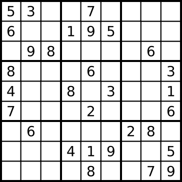

The base knowledge of sudoku
============================

Sudoku is a kind of puzzle game. It is one of the best way to learn logic, and at the same time, the Python language is one of the best computer language to learn logic. 
So, if we can combine these two kinds of tools to teach children or young men to learn logic, it will be perfect. This is why the project be done and going to.

A classic sudoku
----------------

You can study what is sudoku in Wiki Page: http://en.wikipedia.org/wiki/Sudoku
The following is a classic sudoku:

and the following is the solution for it:

.. image:: p3.png

Rules
-----

The basic rules to solve a sudoku is very easy::

    1. Put the number of 1-9 to every line(including x-way and y-way) and every box.
    2. every line and every box can't duplicate of the number of 1-9.

How many possible puzzles in a 9x9 sudoku    
-----------------------------------------

If we put the first number in a the position (1, 1), there are must have 9 numbers can be selected to put in.
Then we put the second number in the postion (1, 2), there are must have 8 numbers can be selected to put in. So, and as it going on, we can write down the possible numbers we can select in
every position:

=== === === === === === === === ===
 9!  6!  3!  6!  3!  1!  3!  1!  1!
=== === === === === === === === ===
 9   6   3   6   3   1   3   1   1
 8   5   2   5   2   1   2   1   1
 7   4   1   4   1   1   1   1   1
 6   3   1   3   1   1   1   1   1
 5   2   1   2   1   1   1   1   1
 4   1   1   1   1   1   1   1   1
 3   1   1   1   1   1   1   1   1
 2   1   1   1   1   1   1   1   1
 1   1   1   1   1   1   1   1   1
=== === === === === === === === ===

So the possible combinations are 9!*6!*3!*6!*3!*1!*3!*1!*1* = 4,514,807,808,000

if we use python to caculate it::

    >>> def n(x):
        if x==1:
            return 1
        else:
            return x*n(x-1)
    
    >>> n(9)*n(6)*n(3)*n(6)*n(3)*n(1)*n(3)*n(1)*n(1)
    
About the mathematics of sudoku, you can get it at Wiki, http://en.wikipedia.org/wiki/Mathematics_of_Sudoku

    