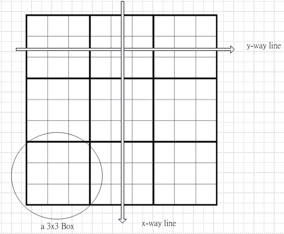

How to make a simulator environment in Python to solve a sudoku
===============================================================

I think classes defined is the most difficult for learner in the OOP method of programming. So in these courses of learning to solve sudoku, 
we don't explain how to make a class, property, and methods in detail. But just make a explanation of the existed classes, properties and methods in this library to learners.
So we can explain these data structures as a simulator environment to solve a sudoku like a human being.

We can first image that there are 9x9 houses in a beautiful valley, and they are build like:

      
.. topic:: **An Imagined World**

    There are 9 countries, every country has 9 people. They decide to live together in this beautiful valley. And there are 9x9 houses, They want to let every people live in one house, and every X-way line, Y-way line, 
    and every 3x3 box include all countries' people. And if so, they can say themselves are a real united group in the world, can you help them?

and then we can start to solve the wondeful world for these people...

What is a Class? and an Object?
-------------------------------

Class is collective name for a group of objects which have same behaviors, features, forms. So, animal can be a class name, and elephant is an kind of object of this class. 

An object is thing which belong a class or multi classes.You can treat an object is an entity of a class, like human is a class, but you is an object, an entity which belong human class.

Depend to the domain which we want to approach,or to define, we will define some different classes to describe the same objects. Like if we want to design a system to manage houses in a place, we may define a 
house class, that contain some people, some pets, and so on... But when our domain is to know all relationships of person, we may define a person class that contain some people, but no pets, 
except we want to study the pets factor in a person relationship.

In this sudoku solving library, we define the following classes:

- Number Class:

    You can treat every number as a different man, there are 9 countries, and every country has 9 men. So we can treat the Number Class as a Country Class.
    Every country has their ID, here is 1-9, and every country would record the positions where their people live in this valley.
    
- Point Class:

    Point is a house here. It indicate that there is empty or not, if it is not empty, which country people lives there? if it is empty, which counties' people can live here?

- GroupBase Class:

    GroupBase is group of X line, Y line or a 3x3 Box. This is base class of Box, lineX, lineY. It indicate which houses are belong to him, 
    how many people have lived in this group? and which counties' people still not live in this group?

- Box Class:

    Every 3x3 block. Every box has its id, from left to right, from top to down, it is assigned 1-9, as the following picture:
    
    .. image:: p5.png

- lineX Class:

    Every x-way line. Every x-way line has its id, from left to right, it is assigned 1-9, as the following picture:
    
    .. image:: p6.png

- lineY Class:

    Every y-way line. Every y-way line has its id, from top to down, it is assigned 1-9, as the following picture:
    
    .. image:: p7.png

- Matrix Class:

    Matrix Class is the WORLD of a sudoku game. It is the beautiful valley, including 9 countries, every country have 9 people, there are 9x9 houses for all these people.

What is a Property?
-------------------

Property is in a class to declaim what it cotain and how they look like or their conditions. Like a person class, may have these properties of how much money he have, how many children he have,
, and first child is boy or girl, how old are them?

The following are the major properties of all classes in this libryary:

- Number class:

    * v: the id of a country, it is 1-9.
    * p: the list of the houses which these country people have lived in
    * filled: how many people have lived in a house

- Point class:

    * x: the x-way postion of this house
    * y: the y-way position of this house
    * v: which country people has lived here, if it is still empty, its value is 0
    * b: this house belogn which 3x3 box
    
- GroupBase class:

    * idx: the id of this group
    * p: the list of the houses which belong this group
    * filled: how many people have lived in this group
    * possible: the list of country id which have not lived in this group

.. sidebar:: What is **effects**?
    
   Effects of a box are the 4 boxes which the same direction of x or y with it. So, effectsX are the boxes that have the same x-way direction, 
   while effectsY are the boxes that have the same y-way direction of it.
    
- Box class:

    * All GroupBase Properties
    * effects: the box id list of a box's neighbors
    * effectsX: the box id list of a box's neighbors which in x-way direction
    * effectsY: the box id list of a box's neighbors which in Y-way direction
    
- lineX class:

    * Having the same properties as GroupBase
    
- lineY class:

    * Having the same properties as GroupBase
    
- Matrix class:

    * p: A two dimention of point(house), from p[0][0] to p[8][8] to present all the houses in this valley.
    * lineX: A list of x-way line of the houses
    * lineY: A list of y-way line of the houses
    * b: A list of 3x3 box of the houses
    * n: A list of Country.
    * filled: how many people have lived in a house now.

What is a Method?
-----------------

Methods are the behaviors of a class or an object. For example, if we define a radio class contain several buttons, then we should define the methods when some button has been pushed.
It may start to receive a program from a station, or record a program into CD, etc...

The following are the major methods of the classes in this library:

- Number class:

    * setit(p1): when a country's people find a house(p1) to live, this method will be called

- Point class:

    * can_see(p1): to check a house can see another house(p1) or not?
    * can_see_those(posList): to check a house can see a list of houses, and return the houses list which it can see them.
    
    .. Note:: What is "**SEE**"?
    
        the houses in the same x-way or y-way line, or in the same box, of a house, this means that this house can **SEE** all of them.
    
- GroupBase class:

    * allow(v): check the group can allow the country people(whose id is v) to live or not?
    * get_num_pos(v): get where the people live in this group who is the country people(whose id is v), if there is no this country's people, it will return None.
    * count_num_possible(count): get the countries' id and houses, which are empty now, and are possible to be assigned to a certain country people, and the houses are equal to the number(count)
    * get_all_pos(method): get all houses in this group, if method="a"; if method="u", get all empty houses, if method="s", get all not empty houses.
    
- Box class:

    * All GroupBase methods
    * get_group_number(num): To Check the num in a box's would form a Group Number or not.
  
    .. Note:: What is "**Group Number**"?
    
        Group Number is in a box. Those houses in this box can and only can allow some country's people, and these houses in a same line(x-way line or y-way line), 
        then we call these houses form a **Group Number**, We don't know which house is the country's people should live finally, 
        but we know the other houses in this line will not allow the same country's people to live.
           
- lineX class:

    * Having the same methods as GroupBase
    
- lineY class:

    * Having the same methods as GroupBase
    
- Matrix class:

    * get_all_pos(method): if method="a", get all houses; if method="u", get all empty houses; if method="s", get all houses where have lived people
    * sort_unassigned_pos_by_possibles(possibles): get all empty houses which are only allowfd for [possibles] countries people, if possibles == 0, it will get all empty houses, 
      and sorted by the possiles from low to high.
    * can_see(p0, method="u", num=0): get the houses which cand the house(p0), if the num!=0, mean get the houses only that are allowed the num country's people.
    * setit(x, y, v): Let the v country's people live in the the house of the position (x, y).
    * reduce(x, y, v): When a country people find a suitable house to live, then any empty house can SEE the house will reduce their possible countries people to live in.
    * allow(x, y, v): check the v country people can live in the house of the position (x, y) or not?
    * read(file): read the first defined that how many people and where they have lived in this valley.
    
Game Defined File
-----------------

You can define sudoku's game by giving x, y, v line by line in a text file.
like the following: its define file is in the [installed directory]/sudoku/data/

.. csv-table:: A sample define and its original and result matrix
    :header: "m3.data", "Original Matrix", "Result Matrix"
    :widths: 15, 35, 35
    
    .. image:: m3.png,.. image:: origin.png,.. image:: result.png

