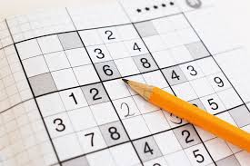

SudokuStudyLib
==============

**This is a python library for studying logic by solving Sudoku and learning the programming of python language.**
Sudoku is a kind of puzzle game. it is one of the best way to learn logic, and at the same time, the Python language is one of the best computer language to learn logic.
So, if we can combine these two kinds of tools to teach children or young men to learn logic, it will be perfect. This is why the project be done and going to.

Welcome to SudokuStudyLib's documentation!
------------------------------------------

Contents:

.. toctree::
   :maxdepth: 2

   intro
   base
   logic
   courses
   data
   program
   sudoku

Indices and tables
------------------

* :ref:`genindex`
* :ref:`modindex`
* :ref:`search`

