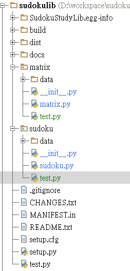

Welcome to SudokuStudyLib's documentation!
==========================================

This is a tool and library for studying Logic and Python programming. It includes two packages, one is Sudoku, and another is Matrix. The Sudoku is an oop approaching library, while the Matrix is a traditional function processing library.

Install
-------
You can use pip to install the library::
   
    pip install SudokuStudyLib

and you can clone the project from::

    https://github.com/RobertOfTaiwan/SudokuStudyLib

When you has installed, it will contain two packages, sudoku, and matrix. The following is the file structure:

Usage
-----

1. OOP method: sudoku, in the test.py::

    from sudoku import *

    # to solve a sudoku defined in data directory
    solve("m18.data")

    pass

    # to solve a sudoku and just using the methods which level <= 15 and if can't solve, don't use guess method
    solve("m3.data", level_limit=15, use_try=False)

    pass

    # to solve a sudoku with emulator methods and print the steps
    solve("m12.data", use_emu=True, print_step=True)

    pass

    # to solve the world's best difficult sudoku
    # by default method
    solve("m10.data")

    # by computer's try error
    try_error(None, file="m10.data")

    # by all methods but not using human guessing, it can't solve the sudoku
    solve("m10.data", use_emu=True, use_try=False)

    # by basic human methods and guess
    solve("m10.data", level_limit=10, use_try=True)
    solve("m10.data", level_limit=3, use_try=True)
    
2. Traditional method: matrix, in the test.py::

    from matrix import *

    # solve it directly
    m, n, p = main("m6.data")

    # solve it by limit methods, it can't solve the sudoku
    m, n, p = main("m3.data", methods=8)

    # set the limit methods to the 10, and it can solve the sudoku
    m, n, p = main("m3.data", methods=10)

    # using the try error's method to solve the best difficult sudoku in the world
    m, n, p = TryError("m10.data")
