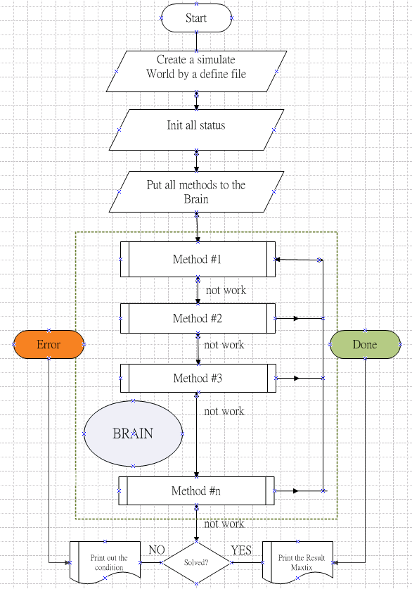

Start Programming to Solve a Sudoku
===================================

When we have created a sudoku simulate world in the computer to solve a sudoku, now we should go ahead to implement some methods which we solve it in our own hands. 
In other world, programming, is the stuff which we teach computer to do something that we have known it.

We first introduce the solve environment, then we will introduce some basic methods in this library.

Solving Environment
-------------------

We create a function solve() to do the real solving a sudoku, and we make two exception classes, SudokuDone, SudokuError to capture event happen when we use methods to solve a sudoku.

.. note:: What is "Exception"?

    Exception is an event defined, when the event condition has occurred, system will stop the processing and jump to the exception processing. 
    There are two major exceptions in the environment:
    
    SudokuDone: 
        when the sudoku has been solved, will raise this exception
        
    SudokuError: 
        when a country people to set in a house, but will break the rule of game, this will raise this exception
        
To let the environment know how many methods they can use to solve a sudoku, we create a class, SolveMethod. We use this class to create all methods in a BRAIN. We can treat this BRAIN like the god of this valley. Every time, 
when people don't how to choose their suitable houses, you can ask the god of valley, and it will give an answer, or it would say that, "**I don't know how to do either!**"

Every method register in the Brain as a SovleMethod object, they have these major properties:

    1. fun: the function name of the method in python coding
    2. idx: the index of the method, from the easier to the more difficult, the brain will use this sequence to solve a game one by one.
    3. name: the name of the method
    4. level: the difficult level for human, using to count a game's difficult level

Solving Process
---------------

The following is the flow chart of solve():

.. Note:: **WORK or NOT WORK?**

    A method works or not means that using this method can:
    
    1. let one or more people to find his or their own house, 
    2. OR can let one or more houses know they are not allowed for some countries' people.
    
In this flow chart, we know that:

1. When a method works to set a person or reduce a house's allowed people, it will return to the first method to restart solving the game.
2. If a method can't work to solve a game, it will give the game to the next method to solve it.
3. And if final method can't solve a game, it will go out and say "I can't figure out this game, sorry!"
4. In the solving process, if "Done" or "Error" event occur, it will go out.
    
Some Basic Methods
------------------

1. fill_only_one_possible:

   Find every house in a group, if there is only one house that one country people can live there, that house must let that country's people to live in.
    
2. fill_last_position_of_group:

   When in a group(line or box) are only one left, it must allow only one country people to live there.
    
3. check_obvious_number:

   Check every country people who has lived in a house, and when these people observe other boxes which has yet not lived their country people, 
   can find an only house that allowed their country people or not?
   
4. check_inobvious_number:

   It is the same method as check_obvious_number, but some boxes' houses are formed as a **Group Number**.

.. sidebar:: What is a **Chain**?

   Chain is formed by two or above houses. In these houses, the amount of all different possible countries' people are equal to the amount of the houses.
   When a chain have formed, we can reduce the possible countries' people from the other houses in the same group of this chain.
   
5. reduce_by_group_number:

   If there is a **Group Number** in a box, the empty houses of its same direction could be reduce the possible country people of this Group Number.
   
6. update_chain:

   As the houses have been lived some people, this would make some empty houses reduce some possible countries' people. 
   And then these empty houses in a group(x-way line, y-way line, box) may form a **Chain**. 
   
How to implement a method?
--------------------------

We could implement a method called check_obvious_for_a_country(m, num) method as an example:

.. code::
:number-lines: 1

        def check_obvious_for_a country(m, num):
        checked = list()
        for p1 in m.n[num].p:
            for b in m.b[p1.b].effects:
                possible = []
                if b in checked:
                    continue
                else:
                    checked.add(b)
                if num not in m.b[b].possible:
                    continue
                for p2 in m.b[b].p:
                    if p2.v != 0 or p2.can_see(p1) > 0:
                        continue;
                    if not m.lineX[p2.x].allow(num):
                        continue
                    if not m.lineY[p2.y].allow(num):
                        continue
                    possible.append(p2)
                if len(possible) == 1:
                    m.setit(possible[0].x, possible[0].y, num, d="Obvious For a Country People")

    #. line#1, define a method, *m* is the world of this game, and **num** is a country id, here is 1-9.
#. line#3, starts to find the all people who have lived in a house of a country.
#. line#4-9, it scan all its effect boxes if those have not been checked.
#. line#10-11, it the country people have live in this box, ignore it.
#. line#12-19, check all empty houses in this box which allow the country's people or not, if yes, put it in the Possible List.
#. line#20-21, if the Possible List has only one house, it must can be assigned this house to the country's people.

